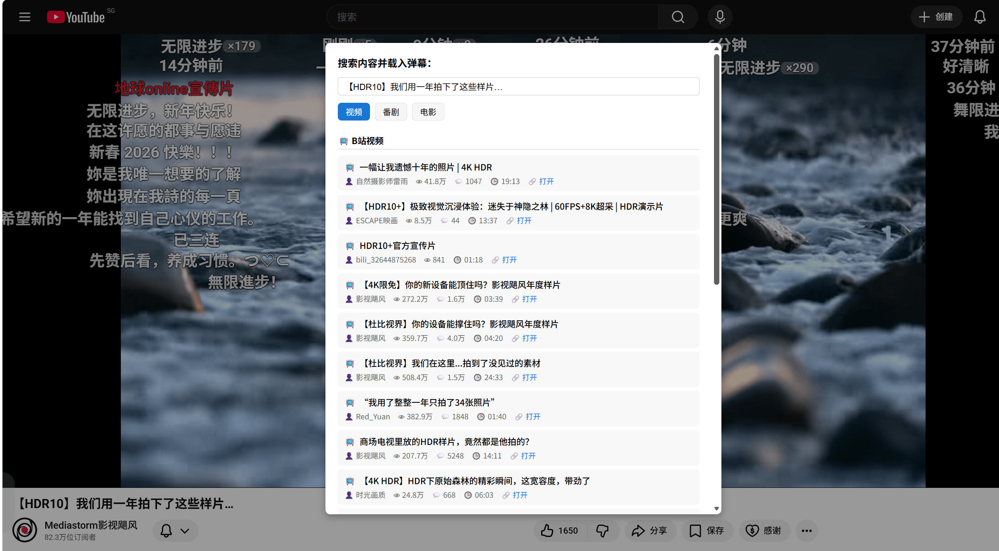
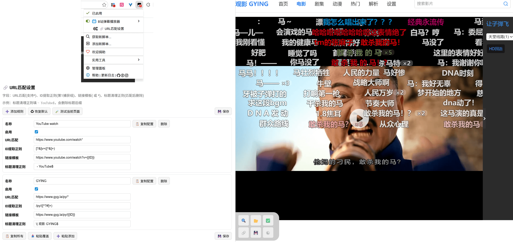

# 🎬 B站弹幕播放器（v2.0.0）

一款用于在网页视频上加载 B 站弹幕并同步播放的油猴脚本。支持从 B 站搜索、从本地文件导入、从缓存恢复、从自建服务拉取，并提供视频时间对齐、显示参数调节、URL 规则自定义等能力。

## ✨ 2.0.0 主要升级

- ✅ 不止Youtube！新增 **URL 匹配规则系统**：可自定义站点匹配、ID 提取、标题清理
- ✅ 搜索面板升级：支持 **视频 / 番剧 / 电影** 分类检索

## ✨ 功能特性

- ✅ 点击 `🔍` 搜索并加载 B 站弹幕
- ✅ 导入本地弹幕文件（`.xml` / `.json`）
- ✅ 自动分配轨道，减少弹幕重叠
- ✅ 支持滚动 / 顶部 / 底部弹幕、颜色、字号等显示
* ✅ 支持设置视频对齐，以便视频有部分不同时同步弹幕
- ✅ 支持缓存弹幕并在后续访问时快速恢复
- ✅ 快捷键：`D` 开关弹幕，`S` 打开搜索
- ✅ 支持配置自建服务地址进行搜索与拉取
- ✅ 支持通过 URL 规则扩展到更多站点/页面

## 🧩 URL 规则（2.0.0）

脚本只依赖固定站点判断，而是通过规则识别“当前页面视频 ID”

可在油猴菜单中打开：`🔗 URL匹配设置`。

### ⚠️ 使用限制

- 仅支持页面中存在原生 `<video>` 元素的网站。
- 一些网站把视频放在 `iframe` 里，当前不支持加载弹幕播放器。

> 只要有 `<video>` 的网页，可直接调用另一个油猴菜单 `🔍 搜索弹幕` （或快捷键 `S` ）加载弹幕，作为临时使用。

